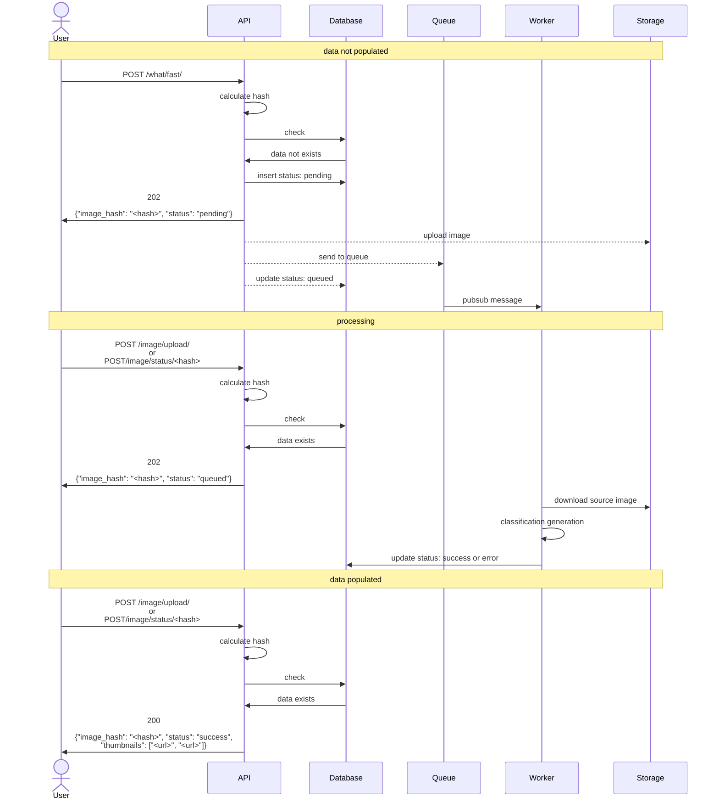
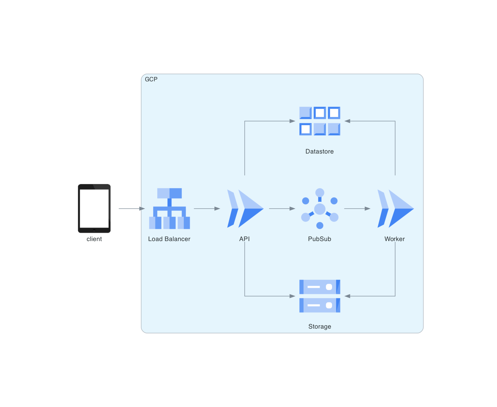

# Python API and background workers on Google Cloud Platform (FastAPI + CloudRun + PubSub)

A self-contained repository with a simple application and related infrastructure configuration.

Putting a Python app and infrastructure together from scratch can be a tedious and tricky process, so I hope this repo will make your life a little bit easier.

[](https://github.com/TobKed/fastapi_cloudrun_pubsub/actions/workflows/ci.yaml)

<!-- START doctoc generated TOC please keep comment here to allow auto update -->
<!-- DON'T EDIT THIS SECTION, INSTEAD RE-RUN doctoc TO UPDATE -->
**Table of Contents**

- [Dealing with Long-Running Tasks in API Development: A Queueing Solution](#dealing-with-long-running-tasks-in-api-development-a-queueing-solution)
- [Example application - Image Classification API](#example-application---image-classification-api)
  - [Application Workflow](#application-workflow)
  - [Code for main endpoints](#code-for-main-endpoints)
    - [Api](#api)
    - [Worker](#worker)
  - [Sequence diagram](#sequence-diagram)
  - [Infrastructure](#infrastructure)
- [Instructions](#instructions)
  - [Warnings !!!](#warnings-)
  - [Prerequisites](#prerequisites)
  - [Cloud infrastructure](#cloud-infrastructure)
    - [Teardown](#teardown)
  - [Local development](#local-development)
    - [Project setup](#project-setup)
  - [Authorize to Google Cloud](#authorize-to-google-cloud)
  - [Run app and tests](#run-app-and-tests)
- [Things to improve](#things-to-improve)
- [Links](#links)

<!-- END doctoc generated TOC please keep comment here to allow auto update -->


## Dealing with Long-Running Tasks in API Development: A Queueing Solution

In the realm of API development, the challenge of handling long-running tasks is a common hurdle that developers often encounter.
Long-running tasks, such as processing large datasets, sending bulk emails, or generating complex reports, can significantly impact the responsiveness and overall performance of an API.
When these tasks are executed synchronously within the API request-response cycle, it can lead to increased response times and potential timeouts, resulting in a subpar user experience.

To tackle this issue, integrating a queueing system into your API architecture proves to be an elegant solution.
A queueing system, such as PubSub on Google Cloud, allows developers to offload these time-consuming tasks from the main API thread.
Instead of processing them immediately, tasks are placed in a queue and executed asynchronously by separate worker processes or services.
This decoupling not only ensures that API requests are swiftly handled, but it also provides the flexibility to scale workers independently to match the workload.

By implementing a queueing system, developers can achieve improved responsiveness, reduced latency, and enhanced scalability for their APIs.
This approach not only elevates the end-user experience but also optimizes the utilization of computing resources.
As a result, long-running tasks can be efficiently managed without impeding the core functionality of the API, offering a streamlined and efficient solution to a common challenge in modern web application development.


## Example application - Image Classification API

The Image Classification API is a small service that allows users to submit images and receive classifications based on the content of those images.
Working with images inherently requires time and computing resources.
However, expecting users to wait several seconds for a response is not user-friendly.
Our example application demonstrates the strategy of offloading time-consuming tasks to a queue, effectively delegating image classification to a dedicated worker.
This approach ensures a seamless user experience while efficiently managing resource-intensive processes.

### Application Workflow

1. #### Image Upload and Hashing:

    When an image is uploaded, the application calculates a hash of the file content.
    This hash serves as a unique identifier for the uploaded image, allowing us to track results and prevent redundant image classification generation.

1. ####  Image Classification Generation Request:

    If Image Classification data is found in the database (based on the hash), it is returned immediately.

    If no Image Classification is found for the uploaded image, the response is sent back promptly, including the hash and a 'pending' status.
    Subsequently, an asynchronous background process uploads the image to the bucket and sends a message to a PubSub queue, which then triggers the Image Classification generation process.

1. #### Queueing and Asynchronous Processing:

    The PubSub queue connects with a worker through a push subscription. When a new message arrives, it's pushed to the worker, initiating Image Classification generation.
    The worker receives the message, generates Image Classification for the image.
    Upon successful Image Classification generation the worker updates the database entry for the corresponding image and is now readily available for retrieval..

1. #### Response with classification:

    Subsequent requests for the image now return a response containing links to the source image and its associated is now readily available for retrieval.
    By following this workflow, we ensure that images are processed efficiently, avoiding duplicate classification generation and providing users with responsive access to their source image and respective classification.

### Code for main endpoints

#### Api

```python
@app.post("/what/fast")
async def what_is_it_fast(
    img: UploadFile,
    background_tasks: BackgroundTasks,
    image_service: ImageService = Depends(ImageService),
) -> ImageClassification | JSONResponse:
    image_service.validate_image(file=img)
    image_hash = await image_service.calculate_hash(file=img)
    image_classification = image_service.get_image_classification(image_hash=image_hash)

    if image_classification:
        logger.info(f"Image Classification already in db: {image_classification=}")
        return image_classification

    logger.info(
        f"Image Classification not found in db, "
        f"sending annotation generation request to the queue: {image_classification=}",
    )

    image_classification = ImageClassification(
        image_hash=image_hash,
        status=ImageAnnotationsGenerationStatus.PENDING,
    )

    image_service.upsert_image_classification(image_classification=image_classification)
    background_tasks.add_task(
        image_service.send_generation_request_to_worker,
        file=img,
        image_classification=image_classification,
    )
    return JSONResponse(status_code=status.HTTP_202_ACCEPTED, content=image_classification)

```

#### Worker

```python
@app.post("/generate_annotations", status_code=status.HTTP_204_NO_CONTENT)
async def generate_annotations(
    pubsub_request: GooglePubSubPushRequestImageClassification,
    image_service: ImageService = Depends(ImageService),
) -> None:
    logger.debug(f"Request from PubSub: {pubsub_request}")

    image_hash = pubsub_request.message.attributes.image_hash
    image_url = pubsub_request.message.attributes.image_url

    try:
        image_classification = image_service.get_image_classification(image_hash=image_hash)
        if not image_classification:
            msg = f"Image Classification not found in db: {image_hash=}"
            logger.info(msg)
            raise AnnotationGenerationError(detail=msg, status_code=status.HTTP_500_INTERNAL_SERVER_ERROR)
        if image_classification.status.is_done():
            logger.info(f"Image Classification is already processed: {image_classification=}")
            return

        image_content = await image_service.get_image_content_from_url(url=image_url)
        annotations = image_service.generate_annotations(contents=image_content)

        image_classification = ImageClassification(
            image_hash=image_hash,
            image_url=image_url,
            annotations=annotations,
            status=ImageAnnotationsGenerationStatus.SUCCESS,
        )
        image_service.upsert_image_classification(image_classification=image_classification)
    except AnnotationGenerationError:
        logger.exception(f"Error generating annotations for Image Classification: {image_hash=}", exc_info=True)
        image_classification = ImageClassification(
            image_hash=image_hash,
            image_url=image_url,
            status=ImageAnnotationsGenerationStatus.ERROR,
        )
        image_service.upsert_image_classification(image_classification=image_classification)
```

### Sequence diagram



### Infrastructure

Our application's infrastructure is fully hosted on Google Cloud.
Here's an overview of the services and components we've integrated:

1. [Cloud HTTP(S) Load Balancer](https://cloud.google.com/load-balancing/docs/https) with [Serverless Network Endpoint Groups (NEGs)](https://cloud.google.com/load-balancing/docs/negs/serverless-neg-concepts): to efficiently distribute incoming traffic across our application's instances.
1. [Cloud Run](https://cloud.google.com/run): (for API and Worker) containerized environment that scales automatically to handle incoming requests.
1. [PubSub](https://cloud.google.com/pubsub): queue to manage our asynchronous task processing.
1. [Datastore](https://cloud.google.com/datastore): a fully managed NoSQL database service.
1. [Cloud Storage](https://cloud.google.com/storage): to store images.



## Instructions

### Warnings !!!

1. Running services and operations costs real **MONEY**. Make sure that you created relevant [budget alerts](https://cloud.google.com/billing/docs/how-to/budgets) and do not leave any resources that consume credits unintentionally.

1. Examples here are not production-ready and do not provide a sufficient level of security. If you want to run it within your organization, consult it with the person responsible for Cloud (e.g. Cloud Security Officer).

1. Remember to edit .gcloudignore and .dockerignore. It excludes all files except implicitly added.

### Prerequisites

Topics you should be familiar with since they will be not covered:

 - Python and [FastAPI](https://github.com/tiangolo/fastapi)
 - Cloud - basic cloud concepts in general
 - [Google Cloud Platform](https://cloud.google.com/): basics of the services, use of `gcloud` CLI, managing billing and permissions.
 - [Terraform](https://www.terraform.io/) -  basic use and concepts. You can also check my tutorial on Medium: [Terraform Tutorial: Introduction to Infrastructure as Code](https://tobiaszkedzierski.medium.com/terraform-tutorial-introduction-to-infrastructure-as-code-dccec643bfdb)

What you should prepare:
 - [Google Cloud Project](https://console.cloud.google.com/) - create a fresh GCP project or use an existing one (but it may cause Terraform exceptions)
 - [`gcloud`](https://cloud.google.com/sdk/gcloud) - install GCP cli and authorize it with a choosen GCP Project
 - [Terraform](https://www.terraform.io/downloads.html) - install the latest version
 - Python 3.11 and [Poetry](https://python-poetry.org/docs/#installation)

### Cloud infrastructure

All infrastructure is defined in Terraform. It creates a project with all required services and permissions.

Example infrastructure is defined in [`terraform/envs/example`](./terraform/envs/example) directory. It creates a project with all required services and permissions.

1. #### Setup variables

    Copy `terraform.tfvars.example` to `terraform.tfvars` and edit it with your values.

    ```bash
    cd terraform/envs/example
    cp terraform.tfvars.example terraform.tfvars
    ```

1. #### Initialize terraform

    ```bash
    terraform init
    ```

1. #### Create artifacts repository

    ```bash
    terraform apply --target=google_artifact_registry_repository.repository
    ```

    It is required to create artifacts registry first, because it is used to store docker images.

1. #### Push docker image to artifacts registry: #1 use GitHub Actions

    You can fork this repository, enable GitHub Actions and then push changes to `master` branch.
    Before doing this you have to setup Open Id Connect Provider and Service Account:

    ```bash
    terraform apply --target=module.github_actions_oidc
    ```

    Then you have to setup GitHub Actions secrets:

     - `project_id`: your-project-project_id
     - `workload_identity_provider`: printed by `terraform output github_actions_oidc_workload_identity_provider`
     - `service_account`: printed by `terraform output github_actions_service_account`

    Replace `TobKed/fastapi_cloudrun_pubsub` to your repository name in [`.github/workflows/ci.yaml`](./.github/workflows/ci.yaml) file.

    After that you can push changes to `master` branch and GitHub Actions will build and push docker image to artifacts registry.


1. #### Push docker image to artifacts registry: #2 use docker locally

    If you are not using GitHub Actions, you can delete `github_actions_oidc.tf` file.

    You can build and push docker image manually:

    ```bash
    EXAMPLE_TAG="europe-west1-docker.pkg.dev/your-project-id/image-classification-generation-repository/image-classification-generation:latest"
    docker build . -f compose/Dockerfile --target production --tag $EXAMPLE_TAG
    docker push $EXAMPLE_TAG
    ```

1. #### Create infrastructure

    If you are not using GitHub Actions, you can delete `github_actions_oidc.tf` file.

    To create rest of infrastructure run:

    ```bash
    terraform apply
    ```

    Outputs should print endpoint under which your app is available, e.g.: `http://34.111.95.123` (add `/docs` at the end to see documentation).
    You may have to wait a few minutes for the app to start and propagate.

#### Teardown

To destroy infrastructure run:

```bash
terraform destroy
```

The safest way to avoid expenses is to delete the whole project.

### Local development

#### Project setup

To set up the project for local development, run bellow commands in the root directory:

```bash
make setup-dev
```

or run manually:

```bash
cp .env.example .env
poetry shell
poetry install
pre-commit install
```

and edit `.env` file with your values.

Important is to set `CLOUD_STORAGE_BUCKET` and `CLOUD_STORAGE_PROJECT_ID` for reasons explained below.

### Authorize to Google Cloud

PubSub and Storage are emulated locally (see [Testing apps locally with the emulator](https://cloud.google.com/pubsub/docs/emulator#install_the_emulator_as_a_container_image)), but there is no emulator available for Cloud Storage.
Therefore, you need to authenticate with Google Cloud to use an actual Cloud Storage bucket.

It can be done by running:

```bash
gcloud auth application-default login
```

or `make gcloud-auth` if you have `make` installed.

ADC credentials will be saved to `$HOME/.config/gcloud/application_default_credentials.json`.
This file will be mounted in docker container (see [`docker-compose.gcp-default-credentials.yaml`](./docker-compose.gcp-default-credentials.yaml)).

See [How Application Default Credentials works](https://cloud.google.com/docs/authentication/application-default-credentials#personal) for more details.

### Run app and tests

Run `make` to see available commands:

```bash
pre-commit                             Run pre-commit on all files
update-pre-commit                      Update pre-commit hooks
run                                    Run docker-compose in detached mode
stop                                   Stop docker-compose
build                                  Build docker-compose from scratch
purge                                  Purge docker-compose
logs                                   Show docker-compose logs
test                                   Run pytest
test-verbose                           Run pytest with verbose output
```

Usually I run `make run` and `make logs` to play with the app.

To run tests, use `make test` or `make test-verbose`.

When app is running documentation is available under http://0.0.0.0:8080/docs for API and http://localhost:8081/docs for worker.

## Things to improve

If you decide to use this repository as a base for your project, you may want to consider the following improvements:

- [ ] Add HTTPS
- [ ] Add authentication
- [ ] Add API versioning
- [ ] Add handling dead letter queue messages (now it is just debug log)
- [ ] Add monitoring and alerting
- [ ] Add more tests

## Links

- [github.com/googleapis/python-pubsub/samples](https://github.com/googleapis/python-pubsub/tree/main/samples)
- [github.com/expobrain/google-pubsub-emulator-python](https://github.com/expobrain/google-pubsub-emulator-python)
- [github.com/inirudebwoy/ml-for-devs-goodiebag](https://github.com/inirudebwoy/ml-for-devs-goodiebag)
