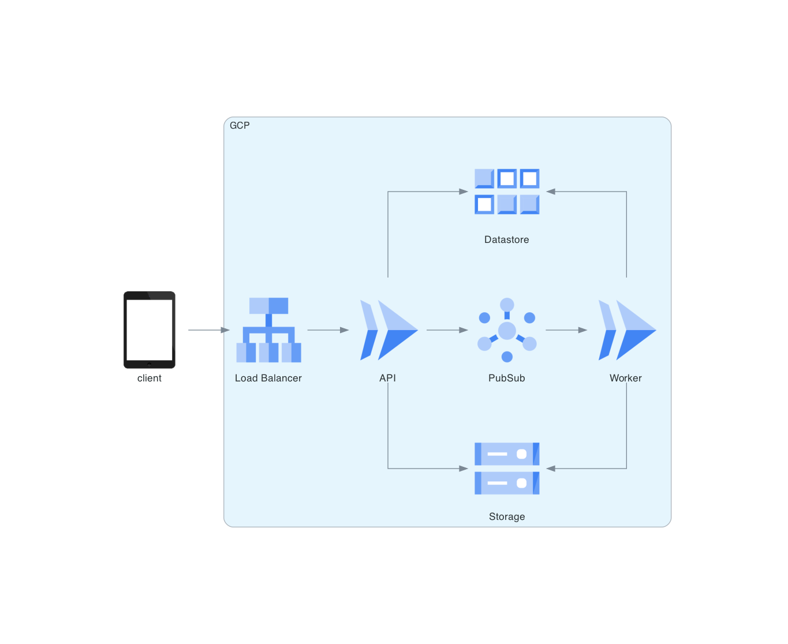

# <!--fit--> ML (Fast)API below 100ms (on GCP)

Tobiasz Kędzierski

[tobked.dev](https://tobked.dev)
[github.com/TobKed](https://github.com/TobKed)
[github.com/TobKed/fastapi_cloudrun_pubsub](https://github.com/TobKed/fastapi_cloudrun_pubsub)

<style scoped>a { color: #36c; }</style>

---

Disclaimer:

The resemblance to real events and individuals is purely coincidental.

---

API on Google Cloud:

 - Cloud Run - container as a service
 - Cloud SQL - PostgreSQL

```python
@app.post("/summary")
def summary_endpoint(
    text: str,
    service: Service = Depends(Service),
):
    summary = service.get_summary_from_db(text=text)

    if summary:
        return summary

    # this is the slow part
    summary = service.get_summary_by_calling_ml_magic(text=text)

    service.save_summary_to_db(text=text, summary=summary)
    return summary
```

---


# <!--fit-->  Huston, we have a problem!

---


#### Requirements as a Suprise:

 - response time SLA: 99 percentile < 100ms
 - throughput: up to 12k requests per minute (200 per second)
 - scaling #1: from 0 to 12k requests per minute in 1 minute
 - scaling #2: different regions / countries

---

####  Requirements #2:

Q: do we have to return always full data?
A: no, we can return `202 Accepted` and process in the background

---

API V2

```python
@app.post("/summary")
def summary_endpoint(
    text: str,
    background_tasks: BackgroundTasks,
    service: Service = Depends(Service),
):
    summary = service.get_summary_from_db(text=text)

    if summary:
        return summary

     # callback will be executed after returing response
    background_tasks.add_task(
        service.send_generation_request_to_worker,
        text=text,
    )
    return JSONResponse(
        status_code=status.HTTP_202_ACCEPTED,
        content={"message": "Accepted for processing"})
```
---

WORKER (PubSub Push subscription)

```python
@app.post(
    "/summary",
    status_code=status.HTTP_204_NO_CONTENT
)
def summary_endpoint(
    pubsub_request: GooglePubSubPushRequest,
    service: Service = Depends(Service),
):
    text = pubsub_request.message.data

    # this is the slow part but we don't care
    summary = service.get_summary_by_calling_ml_magic(text=text)

    service.save_summary_to_db(text=text, summary=summary)
```

---


---


---



---


---

E2E example with Image Classification API
(terraform included)

[github.com/TobKed/fastapi_cloudrun_pubsub](https://github.com/TobKed/fastapi_cloudrun_pubsub)


---


```json
{
  "image_hash": "45f79eb2491...",
  "image_url": "https://storage...",
  "annotations": [
    {
      "index": 1,
      "label": "beer glass",
      "confidence": 0.61
    },
    {
      "index": 2,
      "label": "beer bottle",
      "confidence": 0.06
    },
    {
      "index": 3,
      "label": "restaurant, eating house, eating place, eatery",
      "confidence": 0.03
    },
    ...
  ],
  "status": "success"
}
```
---
